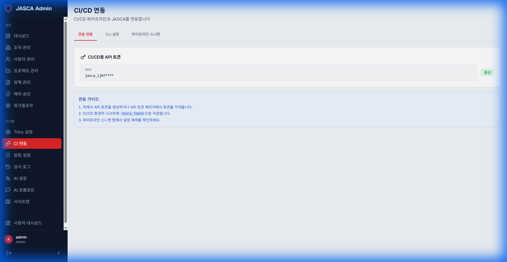

# CI 연동 (CI Integration)

## 개요

Jenkins, GitHub Actions, GitLab CI와 같은 지속적 통합(CI) 시스템과의 통합을 관리합니다. 파이프라인에서 자동 스캔을 위한 웹훅 및 토큰을 생성합니다.

## 주요 기능

- **연동 상태**: 연결된 CI 시스템을 확인합니다.
- **웹훅 관리**: 스캔 트리거 수신을 위한 특정 웹훅을 관리합니다.
- **토큰 생성**: CI/CD 파이프라인 인증을 위한 토큰을 생성합니다.

## 스크린샷



## 정책 배포 게이트 (Policy Verdict)

스캔 결과가 정책을 통과하는지 CI/CD 파이프라인에서 확인해 비준수 빌드를 차단할 수 있습니다.

```
GET /api/policies/verdict?projectId=<프로젝트ID>[&scanResultId=<스캔ID>][&environment=PRODUCTION]
Authorization: Bearer <토큰>
```

- `scanResultId`를 생략하면 프로젝트의 최신 스캔을 평가합니다.
- 응답의 `verdict`가 `PASS` 또는 `FAIL`이며, `violations`에 위반 상세가 포함됩니다.

### 파이프라인 예시 (shell)

```bash
VERDICT=$(curl -sf -H "Authorization: Bearer $JASCA_TOKEN" \
  "$JASCA_URL/api/policies/verdict?projectId=$PROJECT_ID" | jq -r .verdict)

if [ "$VERDICT" != "PASS" ]; then
  echo "정책 위반으로 배포가 차단되었습니다."
  exit 1
fi
```
